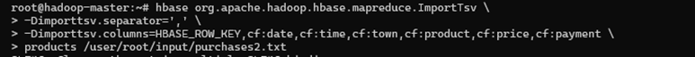
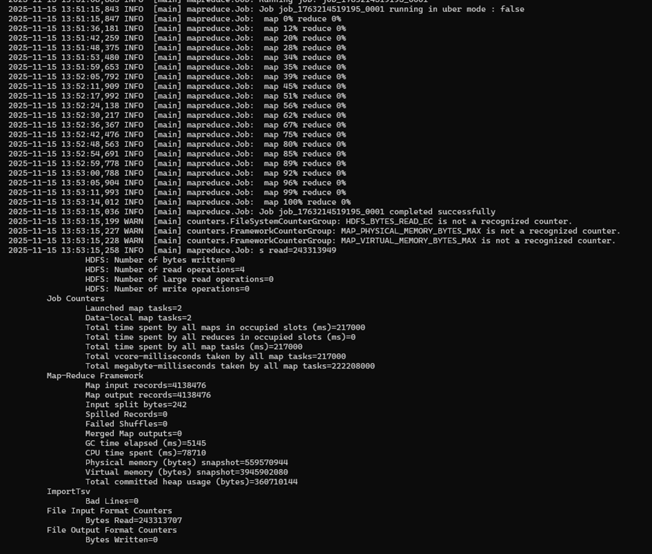
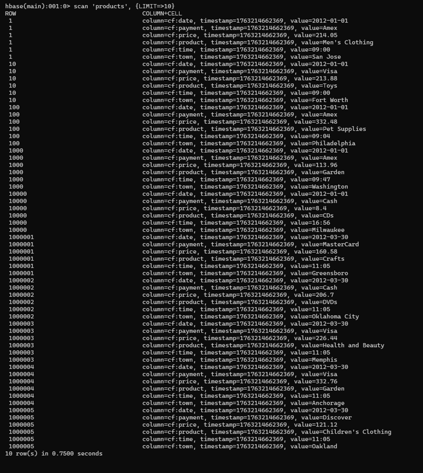
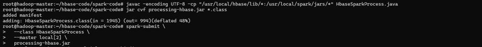
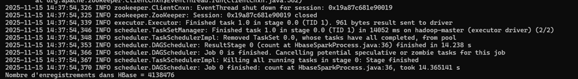
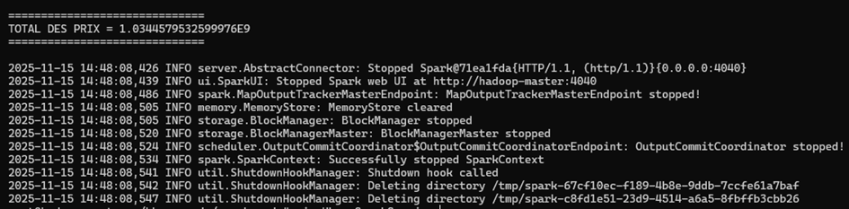
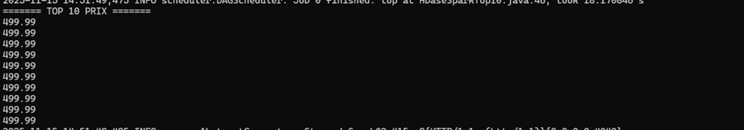
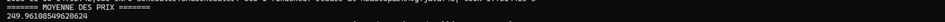

# TP Hadoop – HBase – Spark  
## 📘 Rapport & Screenshots

Ce dossier contient les programmes Java développés pour interagir avec **HBase via Spark**, ainsi que les captures d’écran des différentes étapes du TP : importation des données, exécutions Spark et vérifications dans HBase/Hadoop.

---

# 1️⃣ Importation des données dans HBase

### 🟦 Import du fichier et chargement dans HBase

### 🟦 Vérification du chargement

### 🟦 Exemple de scan

---

# 2️⃣ HbaseSparkProcess – Count des lignes

### ▶️ Lancement du job Spark

### ✔️ Résultat obtenu

---

# 3️⃣ HbaseSparkSum – Somme des prix

---

# 4️⃣ HbaseSparkTOPN – Top des prix

---

# 5️⃣ HbaseSparkAvg – Moyenne des prix

---

📌 **Fin du rapport — tous les traitements Spark + HBase ont été exécutés avec succès.**  
